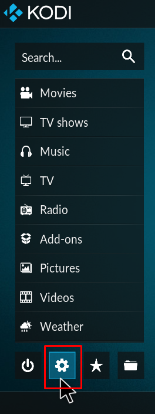
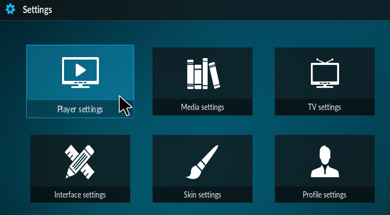
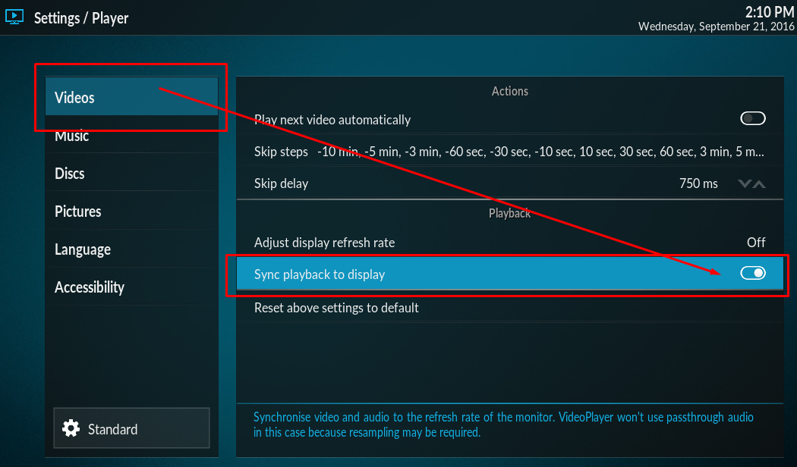
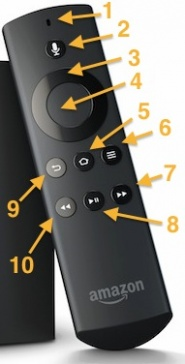

# Kodi Settings for Amazon Fire TV Stick 4K

## Change playback speed and bind to FireTV remote

Kodi (v17 and newer) allows to change the playback speed from 0.8x to 1.5x. For easy access, bind the Rewind and FastForward key on the Fire TV remote with decrease and increase playback speed ([Source](https://forum.kodi.tv/showthread.php?tid=10023&pid=2420219#pid2420219)):

1. Launch Kodi, go to **Settings**.

   
2. Go to **Player settings** >> **Videos**.

   
3. Turn on **Sync playback** to display.

   

4. Exit Kodi - because next you need to create keymap file and Kodi reads it only during start.
5. Copy [customkeymap.xml](userdata/keymaps/customkeymap.xml) to kodi settings folder _.kodi/userdata/keymaps/_ ([Source](https://www.reddit.com/r/kodi/comments/htii7m/comment/fyhz6kk/?utm_source=share&utm_medium=web2x&context=3))
6. Start Kodi. 
7. While playback in fullscreen, long press button 10 to decrease and button 7 to increase playback speed.

   

   [Image Source](https://kodi.wiki/view/Alternative_keymaps_for_Fire_TV_remote)

## Copy files to Amazon FireTV

1. Download adbLink from http://jocala.com/
2. Enable ABD-Debugging on FireTV
3. Connect to FireTV (first connection requires donfirmation on FireTV)
4. Use FileManager to push files on FireTV